# Deploying Qualys Security Agents on OpenShift with the Qualys Nanny Operator

Securing containerized workloads requires visibility at multiple layers: the host operating system, container images, runtime behavior, and the orchestration platform itself. This post walks through deploying the complete Qualys security stack on OpenShift clusters using the Qualys Nanny Operator.

## Architecture Overview

The Qualys Nanny Operator manages two primary custom resources that deploy five distinct security components:

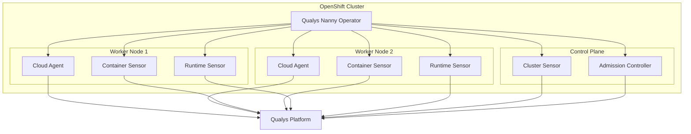

## Custom Resource Hierarchy

The operator uses three CRDs with a hierarchical relationship:

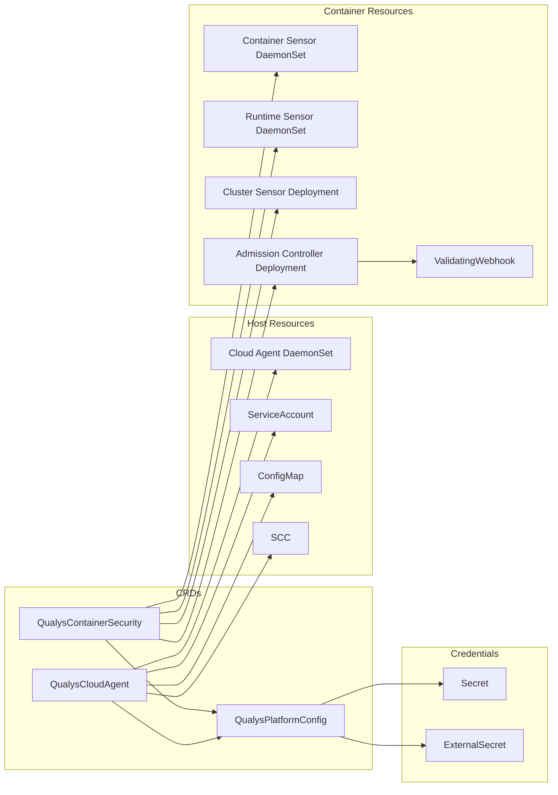

## Security Components

### Component Overview

| Component | CR | Type | Purpose |
|-----------|-----|------|---------|
| Cloud Agent | QualysCloudAgent | DaemonSet | Host-level vulnerability and compliance scanning |
| Container Sensor | QualysContainerSecurity | DaemonSet | Container image and runtime vulnerability scanning |
| Cluster Sensor | QualysContainerSecurity | Deployment | K8s API monitoring, workload inventory, network activity |
| Admission Controller | QualysContainerSecurity | Deployment + Webhook | Security policy enforcement on resource creation |
| Runtime Sensor | QualysContainerSecurity | DaemonSet | eBPF-based file and process event tracking |

### Default Configuration

| Component | Default State |
|-----------|---------------|
| Cloud Agent | Enabled (separate CR) |
| Container Sensor | Enabled |
| Cluster Sensor | Enabled |
| Admission Controller | Disabled |
| Runtime Sensor | Disabled |

## Qualys Cloud Agent on CoreOS and RHEL

The Cloud Agent performs host-level vulnerability management and compliance scanning. On immutable operating systems like CoreOS, traditional agent installation isn't possible. The operator solves this by running the agent as a privileged container with host access.

### Deployment Modes

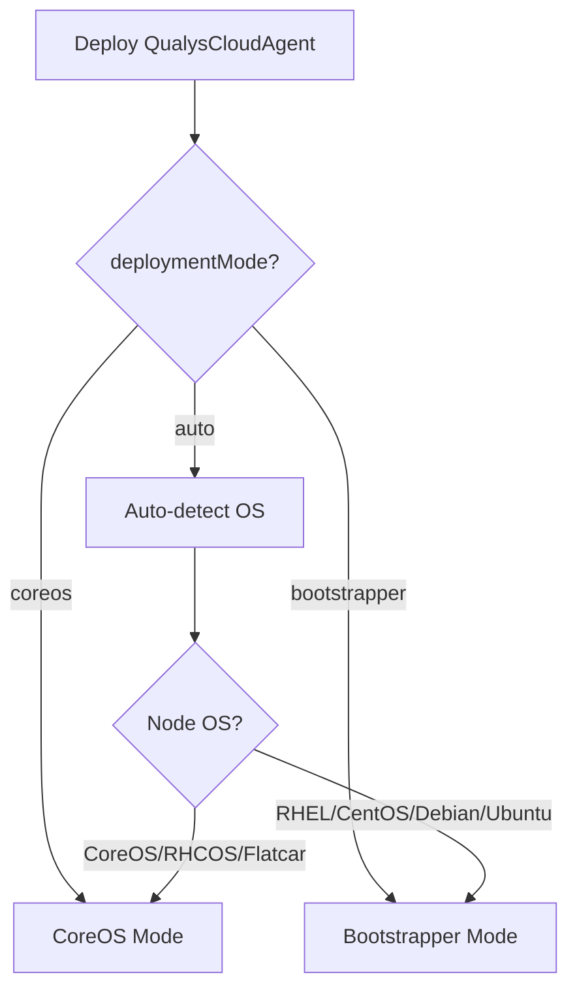

| Mode | OS Types | Image | Description |
|------|----------|-------|-------------|
| `bootstrapper` | RHEL, CentOS, Debian, Ubuntu | `nelssec/qualys-agent-bootstrapper` | Installs agent on host via nsenter |
| `coreos` | CoreOS, RHCOS, Flatcar | `qualys/qagent-rhcos` | Runs agent in container (immutable OS) |

### Host Mounts Required

```mermaid
flowchart LR
    AGENT[Cloud Agent Pod]

    AGENT --> ETC[/etc]
    AGENT --> VAR[/var]
    AGENT --> PROC[/proc]
    AGENT --> SYS[/sys]
    AGENT --> OPT[/opt/qualys]
```

### CoreOS Considerations

CoreOS uses an immutable root filesystem with atomic updates. The agent handles this by:

- Storing persistent data in `/opt/qualys` (mounted from the host)
- Using the host's `/etc/machine-id` for consistent host identification
- Running as a privileged container to access host namespaces

## Container Security Components

The QualysContainerSecurity CR manages four components that can be independently enabled or disabled.

### Container Sensor (DaemonSet)

Scans container images and running containers for vulnerabilities.

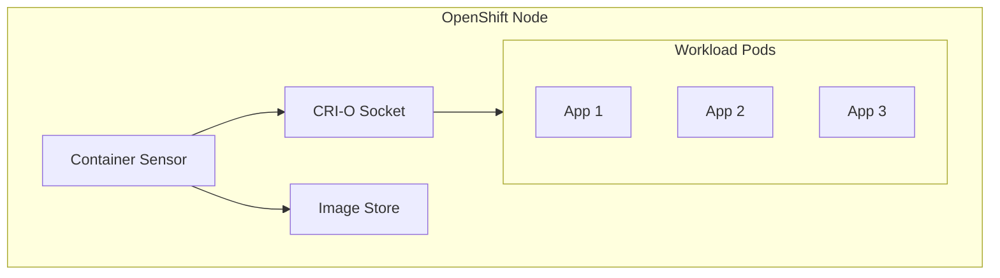

**Features:**
- Image vulnerability scanning
- Running container scanning
- Malware detection (optional)
- Secret detection (optional)

### Cluster Sensor (Deployment)

Monitors the Kubernetes API server for cluster-wide visibility.

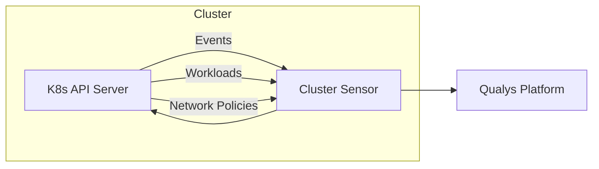

**Features:**
- Cluster event monitoring
- Workload inventory
- Network policy analysis
- RBAC visibility

### Admission Controller (Deployment + Webhook)

Enforces security policies on resource creation and updates.

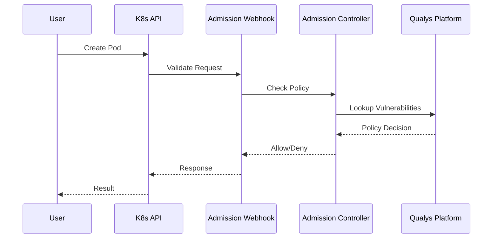

**Features:**
- Block deployment of vulnerable images
- Enforce security baselines
- Configurable failure policy (Fail/Ignore)
- Namespace-scoped enforcement

### Runtime Sensor (DaemonSet)

Uses eBPF for kernel-level visibility into container behavior.

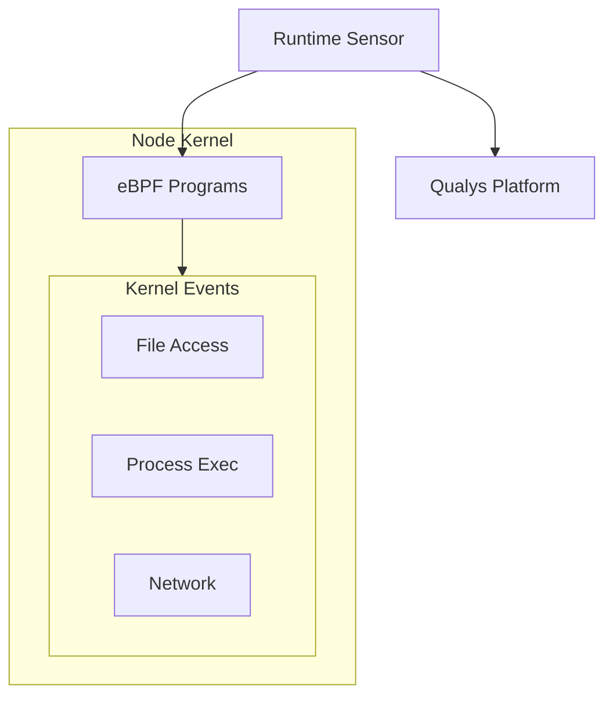

**Features:**
- Real-time file integrity monitoring
- Process execution tracking
- Network connection visibility
- Behavioral anomaly detection

## Installation

### 1. Create Namespace and Credentials

```yaml
apiVersion: v1
kind: Namespace
metadata:
  name: qualys
---
apiVersion: v1
kind: Secret
metadata:
  name: qualys-credentials
  namespace: qualys
type: Opaque
stringData:
  ACTIVATION_ID: "xxxxxxxx-xxxx-xxxx-xxxx-xxxxxxxxxxxx"
  CUSTOMER_ID: "xxxxxxxx-xxxx-xxxx-xxxx-xxxxxxxxxxxx"
```

### 2. Create Platform Configuration

```yaml
apiVersion: qualys.qualys.io/v1alpha1
kind: QualysPlatformConfig
metadata:
  name: qualys-platform
spec:
  platform:
    serverUri: "https://qagpublic.qg2.apps.qualys.com/CloudAgent/"
  credentials:
    sourceType: secret
    secretRef:
      name: qualys-credentials
      namespace: qualys
```

### 3. Deploy Cloud Agent (Host Scanning)

```yaml
apiVersion: qualys.qualys.io/v1alpha1
kind: QualysCloudAgent
metadata:
  name: qualys-cloud-agent
  namespace: qualys
spec:
  platformConfigRef:
    name: qualys-platform
  deploymentMode: auto
  config:
    logLevel: 3
  scheduling:
    tolerations:
      - operator: Exists
```

### 4. Deploy Container Security

```yaml
apiVersion: qualys.qualys.io/v1alpha1
kind: QualysContainerSecurity
metadata:
  name: qualys-container-security
  namespace: qualys
spec:
  platformConfigRef:
    name: qualys-platform
  containerSensor:
    enabled: true
    mode: general
    k8sMode: true
    scanning:
      enableImageScan: true
      enableContainerScan: true
  clusterSensor:
    enabled: true
    replicas: 1
  admissionController:
    enabled: false
    failurePolicy: Ignore
  runtimeSensor:
    enabled: false
  containerRuntime:
    type: auto
```

## Reconciliation Flow

The operator continuously reconciles the desired state with the actual state:

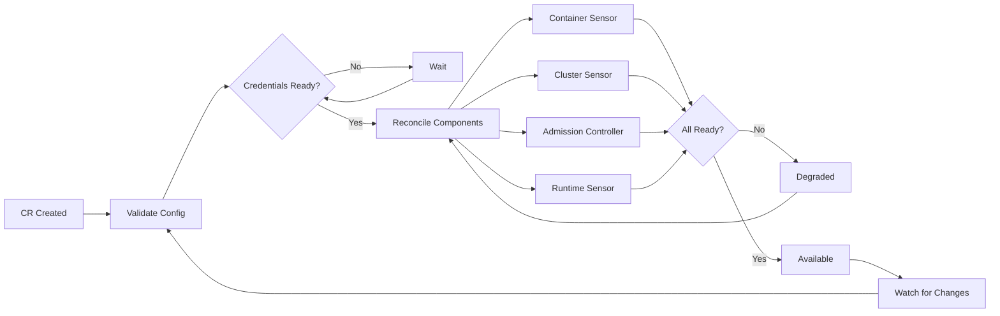

## Security Context Constraints

On OpenShift, the operator automatically creates SCCs to grant the required privileges:

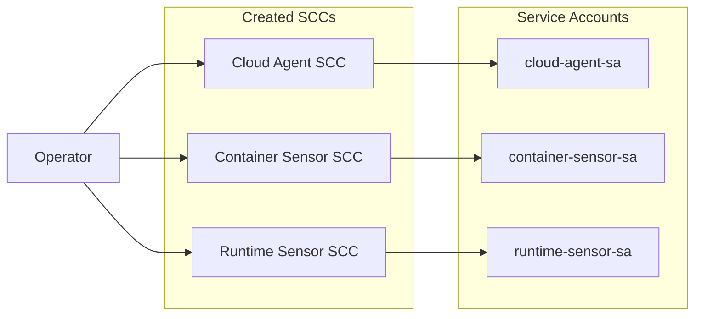

**Cloud Agent SCC grants:**
- `privileged: true`
- `hostPID: true`
- `SYS_ADMIN` capability

**Container Sensor SCC grants:**
- `hostNetwork: true`
- Container runtime socket access

**Runtime Sensor SCC grants:**
- `privileged: true`
- eBPF capabilities

## Monitoring Deployment Status

```bash
kubectl get qualysplatformconfig qualys-platform -o yaml
kubectl get qualyscloudagent -n qualys -o wide
kubectl get qualyscontainersecurity -n qualys -o wide
kubectl get pods -n qualys -o wide
```

Example output:

```
NAME                       CONTAINER   CLUSTER   ADMISSION   RUNTIME   AGE
qualys-container-security  true        true      false       false     2h
```

## Data Flow to Qualys Platform

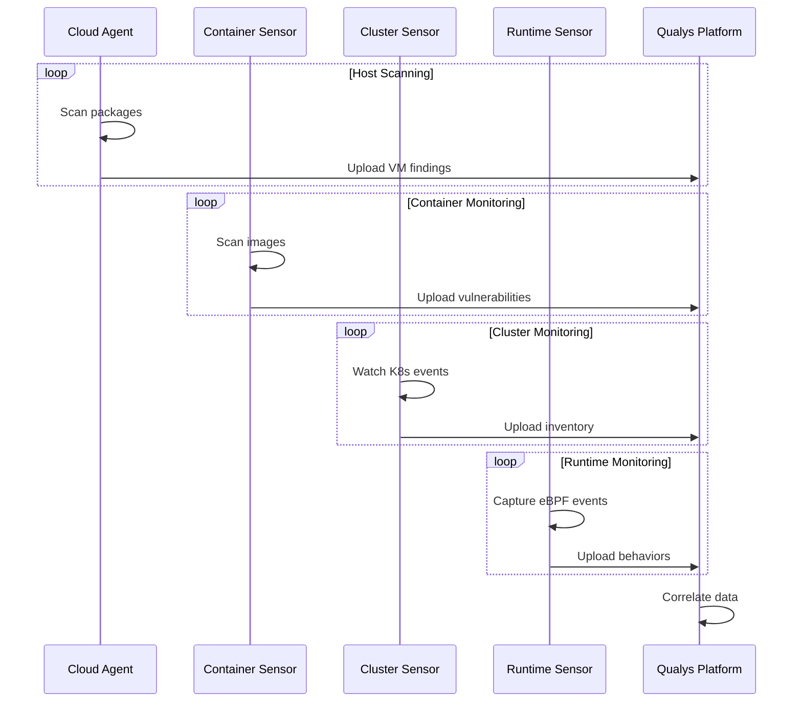

## Troubleshooting

### Component Not Starting

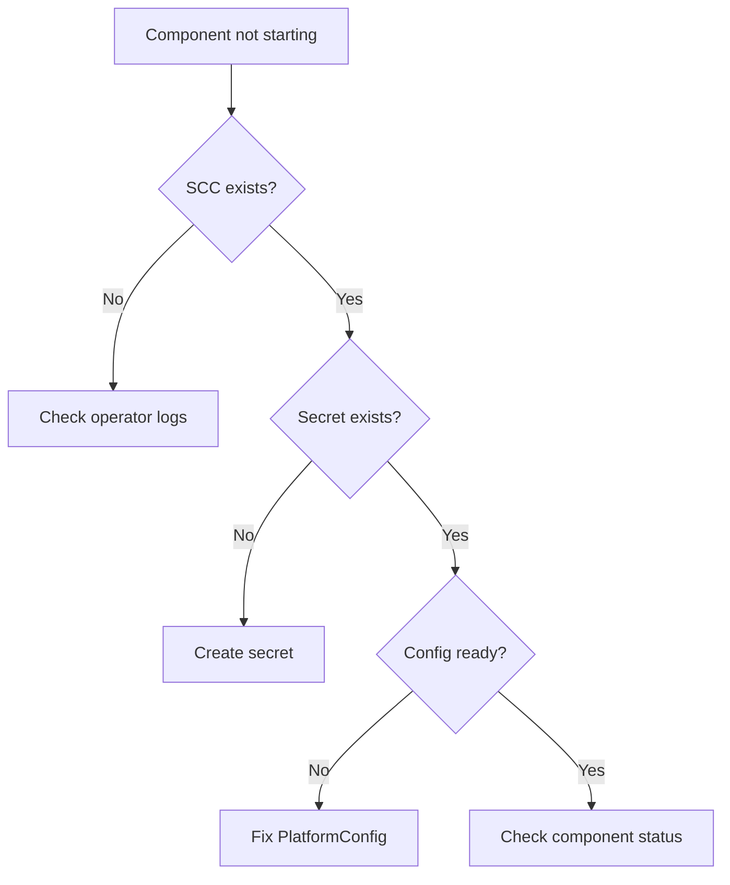

### Common Issues

| Issue | Cause | Solution |
|-------|-------|----------|
| Pods pending | Missing SCC | Check operator logs for SCC creation errors |
| CrashLoopBackOff | Invalid credentials | Verify ACTIVATION_ID and CUSTOMER_ID |
| No data in Qualys | Network blocked | Check firewall rules for Qualys platform URLs |
| ImagePullBackOff | Registry access | Configure imagePullSecrets |
| Admission webhook errors | Service unavailable | Check admission controller pod logs |

## Conclusion

The Qualys Nanny Operator simplifies deploying the complete Qualys security stack across OpenShift clusters by:

- Managing five security components through two custom resources
- Supporting component-level enable/disable toggles
- Handling the complexity of privileged container configuration
- Automatically managing OpenShift SCCs
- Supporting both immutable (CoreOS) and traditional (RHEL) node operating systems
- Providing Kubernetes-native status reporting through CR conditions

For more information, see the [Qualys Nanny GitHub repository](https://github.com/nelssec/qualys-nanny).
