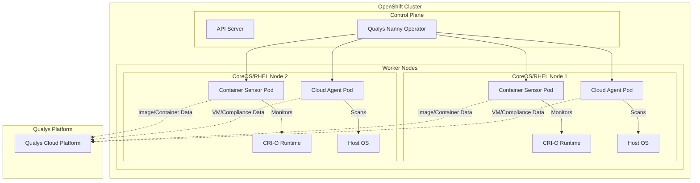
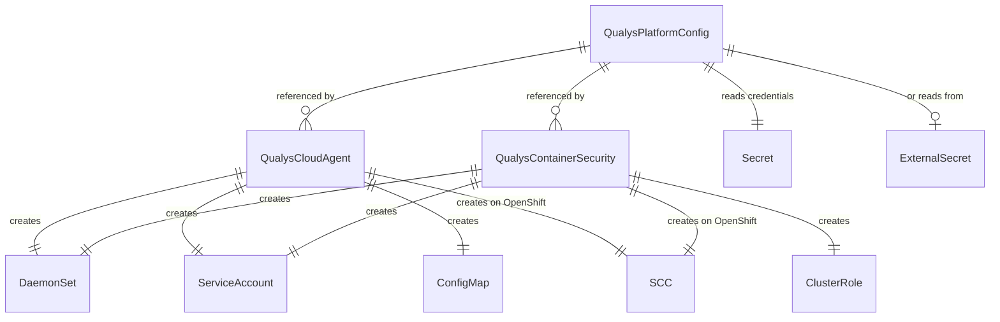
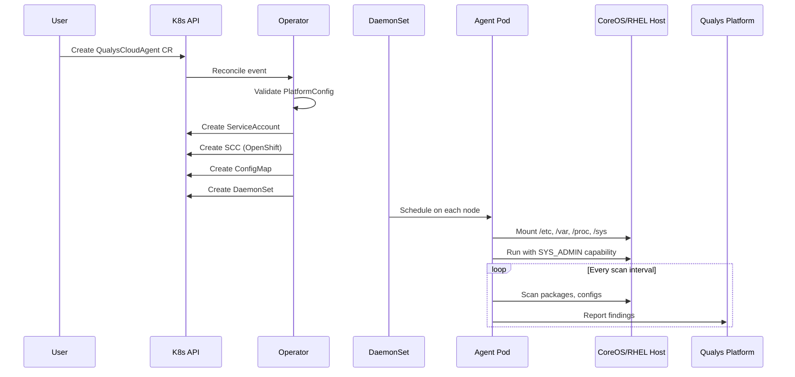
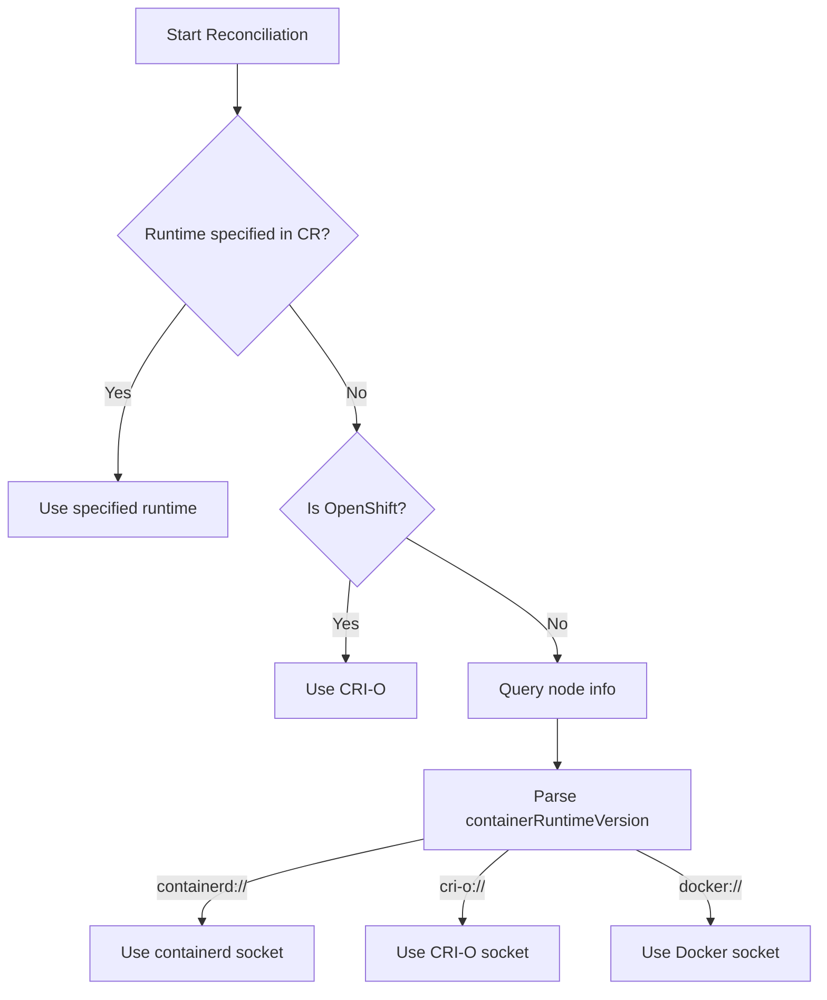
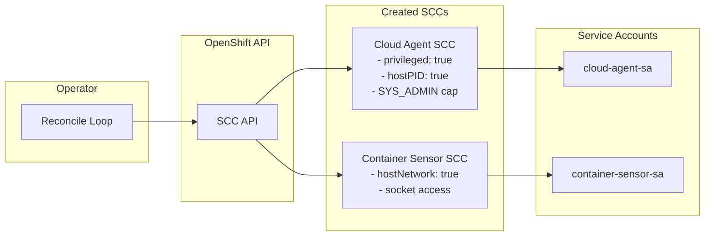
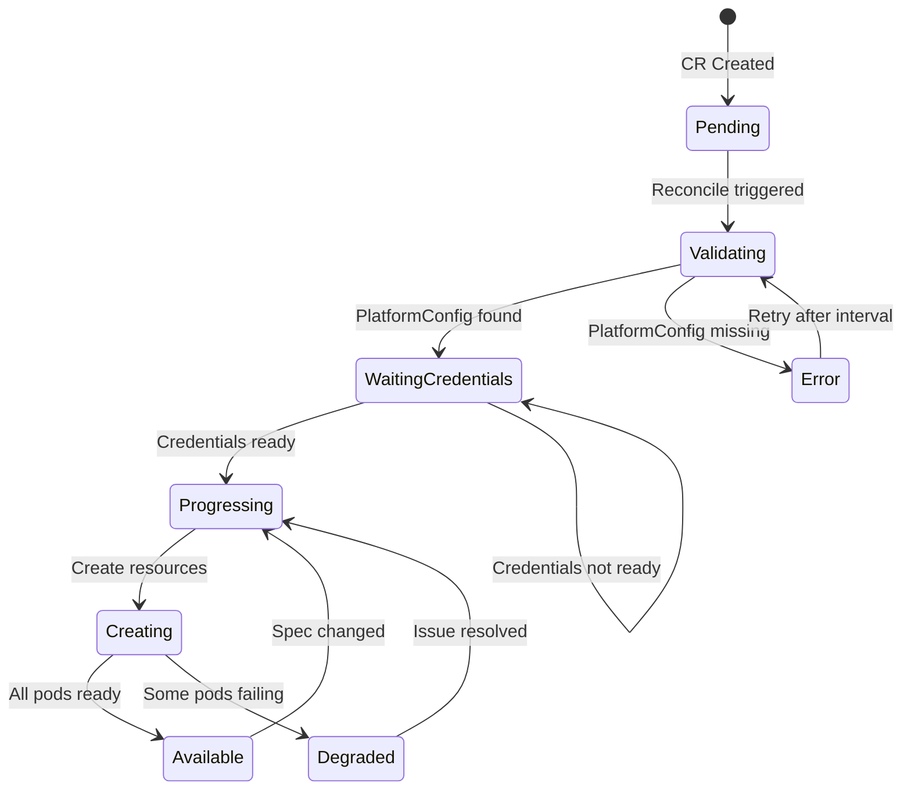
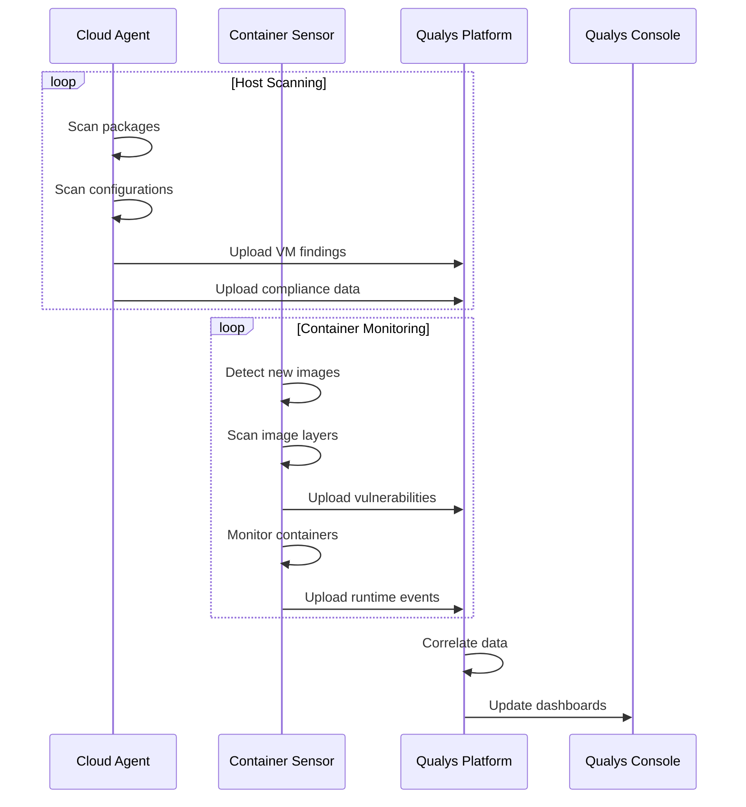
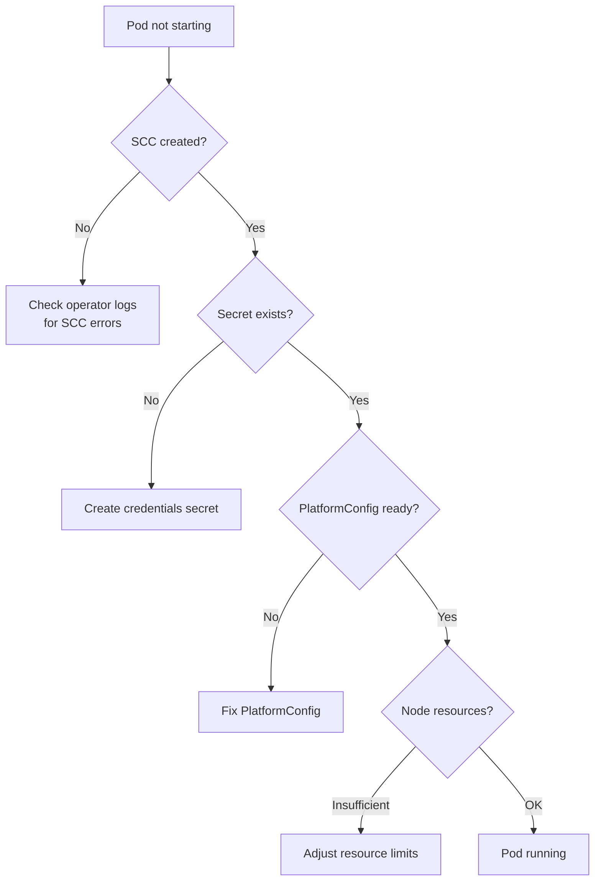

# Deploying Qualys Security Agents on OpenShift with the Qualys Nanny Operator

Securing containerized workloads requires visibility at multiple layers: the host operating system, the container runtime, and the orchestration platform. This post walks through deploying Qualys Cloud Agent for host-level scanning on CoreOS and RHEL nodes, and the Qualys Container Security Sensor for container and image scanning on OpenShift clusters.

## Architecture Overview

The Qualys Nanny Operator manages two distinct security agents through Kubernetes-native custom resources:



## Custom Resource Hierarchy

The operator uses three CRDs with a hierarchical relationship:



## Qualys Cloud Agent on CoreOS and RHEL

The Cloud Agent performs host-level vulnerability management and compliance scanning. On immutable operating systems like CoreOS, traditional agent installation isn't possible. The operator solves this by running the agent as a privileged container with host access.

### How It Works



### Host Mounts Required

The Cloud Agent requires extensive host access to perform vulnerability and compliance scanning:

```mermaid
flowchart LR
    subgraph Agent Pod
        AGENT[qualys-cloud-agent]
    end

    subgraph Host Filesystem
        ETC[/etc - OS configs]
        VAR[/var - Package DBs]
        PROC[/proc - Process info]
        SYS[/sys - Kernel params]
        OPT[/opt/qualys - Agent data]
        HOSTID[/etc/machine-id]
    end

    AGENT --> ETC
    AGENT --> VAR
    AGENT --> PROC
    AGENT --> SYS
    AGENT --> OPT
    AGENT --> HOSTID
```

### Installation Steps

1. **Create the namespace and credentials:**

```yaml
apiVersion: v1
kind: Namespace
metadata:
  name: qualys-system
---
apiVersion: v1
kind: Secret
metadata:
  name: qualys-credentials
  namespace: qualys-system
type: Opaque
stringData:
  ACTIVATION_ID: "xxxxxxxx-xxxx-xxxx-xxxx-xxxxxxxxxxxx"
  CUSTOMER_ID: "xxxxxxxx-xxxx-xxxx-xxxx-xxxxxxxxxxxx"
```

2. **Create the platform configuration:**

```yaml
apiVersion: qualys.qualys.io/v1alpha1
kind: QualysPlatformConfig
metadata:
  name: qualys-platform
spec:
  platform:
    serverUri: "https://qagpublic.qg2.apps.qualys.com/CloudAgent/"
  credentials:
    sourceType: secret
    secretRef:
      name: qualys-credentials
      namespace: qualys-system
```

3. **Deploy the Cloud Agent:**

```yaml
apiVersion: qualys.qualys.io/v1alpha1
kind: QualysCloudAgent
metadata:
  name: qualys-cloud-agent
  namespace: qualys-system
spec:
  platformConfigRef:
    name: qualys-platform
  image:
    repository: nelssec/qualys-agent-bootstrapper
    tag: v2.1.0
  config:
    logLevel: 3
  scheduling:
    tolerations:
      - operator: Exists
```

### CoreOS Considerations

CoreOS uses an immutable root filesystem with atomic updates. The agent handles this by:

- Storing persistent data in `/opt/qualys` (mounted from the host)
- Using the host's `/etc/machine-id` for consistent host identification
- Running as a privileged container to access host namespaces

```mermaid
flowchart TB
    subgraph CoreOS Node
        subgraph Read-Only Root
            OS[/usr - Immutable OS]
        end

        subgraph Writable Paths
            ETC[/etc - Configs]
            VAR[/var - Data]
            OPT[/opt - Extensions]
        end

        subgraph Agent Pod
            QA[Qualys Agent]
        end
    end

    QA -->|Reads| OS
    QA -->|Reads| ETC
    QA -->|Reads| VAR
    QA -->|Writes| OPT
```

## Container Security Sensor on OpenShift

The Container Security Sensor monitors container images and running containers for vulnerabilities, malware, and secrets.

### Runtime Detection

The operator automatically detects the container runtime on OpenShift:



### Sensor Architecture

```mermaid
flowchart TB
    subgraph OpenShift Node
        subgraph Container Sensor Pod
            SENSOR[QCS Sensor]
            SCANNER[Image Scanner]
            MONITOR[Runtime Monitor]
        end

        subgraph CRI-O Runtime
            SOCKET[/var/run/crio/crio.sock]
            IMAGES[(Image Store)]
            CONTAINERS[(Running Containers)]
        end

        subgraph Workload Pods
            APP1[App Container 1]
            APP2[App Container 2]
            APP3[App Container 3]
        end
    end

    SENSOR --> SOCKET
    SCANNER --> IMAGES
    MONITOR --> CONTAINERS

    CONTAINERS -.-> APP1
    CONTAINERS -.-> APP2
    CONTAINERS -.-> APP3
```

### Installation Steps

1. **Ensure platform config exists** (from previous section)

2. **Deploy the Container Security Sensor:**

```yaml
apiVersion: qualys.qualys.io/v1alpha1
kind: QualysContainerSecurity
metadata:
  name: qualys-container-sensor
  namespace: qualys-system
spec:
  platformConfigRef:
    name: qualys-platform
  image:
    repository: qualys/qcs-sensor
    tag: 1.22.0
  containerRuntime:
    type: auto
  sensorConfig:
    mode: general
    k8sMode: true
    scanning:
      enableImageScan: true
      enableContainerScan: true
```

### Security Context Constraints

On OpenShift, the operator automatically creates SCCs to grant the required privileges:



## Reconciliation Flow

The operator continuously reconciles the desired state with the actual state:



## Monitoring Deployment Status

Check the status of your deployments:

```bash
# Platform config status
kubectl get qualysplatformconfig qualys-platform -o yaml

# Cloud Agent status
kubectl get qualyscloudagent -n qualys-system -o wide

# Container Sensor status
kubectl get qualyscontainersecurity -n qualys-system -o wide

# View pods across all nodes
kubectl get pods -n qualys-system -o wide
```

Example output:

```
NAME                  DESIRED   READY   AVAILABLE   STATUS   AGE
qualys-cloud-agent    5         5       5           True     2h

NAME                      RUNTIME   DESIRED   READY   AVAILABLE   STATUS   AGE
qualys-container-sensor   cri-o     5         5       5           True     2h
```

## Data Flow to Qualys Platform



## Troubleshooting

### Agent Not Starting



### Common Issues

| Issue | Cause | Solution |
|-------|-------|----------|
| Pods pending | Missing SCC | Check operator logs for SCC creation errors |
| CrashLoopBackOff | Invalid credentials | Verify ACTIVATION_ID and CUSTOMER_ID |
| No data in Qualys | Network blocked | Check firewall rules for Qualys platform URLs |
| ImagePullBackOff | Registry access | Configure imagePullSecrets |

## Conclusion

The Qualys Nanny Operator simplifies deploying security agents across OpenShift clusters by:

- Handling the complexity of privileged container configuration
- Automatically managing OpenShift SCCs
- Supporting both immutable (CoreOS) and traditional (RHEL) node operating systems
- Providing Kubernetes-native status reporting through CR conditions

For more information, see the [Qualys Nanny GitHub repository](https://github.com/nelssec/qualys-nanny).
